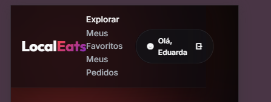
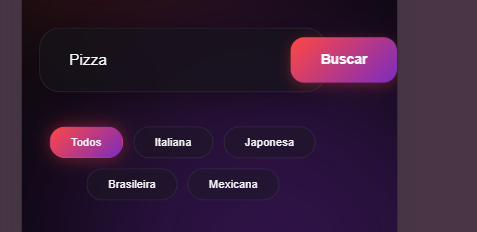

# Planejamento e Execução de Testes - LocalEats

**Integrantes:** Eduarda, Amanda e Luísa
**Sistema Alvo:** [LocalEats Vercel](https://local-eats-unisenac.vercel.app/)

## 1. Plano de Testes
- **Objetivo:** Validar a estabilidade das funcionalidades de busca e a adaptabilidade da interface em dispositivos móveis.
- **Escopo:** Página Inicial, Barra de Pesquisa, Login e Responsividade Mobile.
- **Critério de Aceitação:** O sistema deve filtrar corretamente os dados e ser 100% utilizável em telas pequenas (iPhone SE/Android).

## 2. Registro de Execução e Evidências

| ID | Descrição | Status | Observações Críticas | Evidência Visual |
| :--- | :--- | :--- | :--- | :--- |
| **CT-01** | Busca por Culinária | **FALHOU** | Resultados irrelevantes (ex: busca por 'Pizza' retornou 'Churrascaria'). |  |
| **CT-02** | Responsividade (Geral) | **FALHOU** | Elementos sobrepostos e textos cortados impedem a leitura. |  |
| **CT-03** | Menu/Interação Mobile | **FALHOU** | Dificuldade em clicar nos botões devido ao tamanho e posição. |  |
| **CT-04** | Inspeção de Rede | **ANALISADO** | Identificados gargalos de carregamento via Console/Network. |  |

## 3. Análise Detalhada dos Resultados
A execução dos testes confirmou as hipóteses levantadas na estratégia inicial:
1. **Falha de Backend:** O motor de busca não está filtrando por categorias exatas, o que gera frustração no usuário (ver `busca_incorreta.png`).
2. **Falha de Frontend:** O layout quebra drasticamente em resoluções mobile. Conforme as evidências `layout_mobile_quebrado_01.png` e `layout_mobile_quebrado_02.png`, o usuário é incapaz de navegar ou fazer login de forma intuitiva.
3. **Performance:** A análise técnica (`inspecao_tecnica.png`) revelou requisições pendentes que explicam a lentidão relatada.

## 4. Conclusão e Recomendações
Recomendamos a revisão imediata do arquivo de estilos (CSS) para dispositivos móveis e a refatoração da lógica de busca no banco de dados. Sem essas correções, a taxa de rejeição do LocalEats continuará alta.