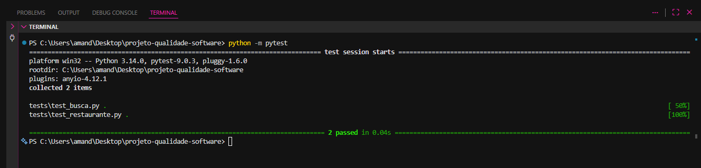

# PBL 6 - Testes Unitários Automatizados e TDD

> **Equipe:** asgurias (Amanda Duarte, Eduarda Costa e Luísa Rabassa)
> **Sistema Alvo:** LocalEats
> **Ferramentas:** Python 3 + Pytest

## 1. Contexto e Objetivo
O objetivo desta etapa é aplicar a prática de TDD (Test-Driven Development) para garantir a qualidade diretamente no código, automatizando a validação das regras de negócio no backend (lógica pura) e prevenindo regressões, superando as limitações dos testes puramente manuais.

## 2. Regras de Negócio Escolhidas
Focamos em duas regras críticas identificadas nos diagnósticos anteriores:
1. **Sanitização da Busca (`src/busca.py`):** Garantir que a entrada do usuário seja limpa (remoção de espaços, tratamento de nulos e *case insensitivity*) antes de consultar a base.
2. **Filtro de Restaurantes Ativos (`src/restaurante.py`):** Garantir que estabelecimentos com a flag `"aberto": False` não sejam retornados para a listagem do usuário.

## 3. Aplicação do Ciclo TDD

Aplicamos rigorosamente o ciclo de desenvolvimento orientado a testes:

- **🔴 RED:** Iniciamos escrevendo os testes (ex: `test_busca.py` e `test_restaurante.py`) mapeando o comportamento esperado. Ao rodar o `pytest`, os testes falharam propositalmente pois a lógica não existia.
- **🟢 GREEN:** Escrevemos o código mínimo necessário em `src/busca.py` e `src/restaurante.py` apenas para satisfazer as asserções dos testes, fazendo o terminal ficar verde.
- **🔵 REFACTOR:** Otimizamos o código adicionando *Type Hints* do Python e refatoramos os testes da busca utilizando o poder do `@pytest.mark.parametrize` para testar múltiplos cenários de forma limpa e escalável, sem quebrar a funcionalidade.

## 4. Evidência de Execução

Abaixo, a execução da nossa suíte de testes unitários retornando sucesso absoluto (`passed`) para todas as validações de regras de negócio.

## 5. Reflexão no Contexto do LocalEats

**Foi difícil escrever testes antes do código?**
No início, a prática é contra-intuitiva. O instinto natural da engenharia é focar imediatamente na solução (o "como fazer"), mas o TDD nos força a pensar primeiro no requisito estrutural e no resultado esperado (o "o que deve acontecer"). Após as primeiras funções, o fluxo se tornou mais natural.

**O TDD ajudou no desenvolvimento?**
Sim. O principal benefício foi evitar o excesso de engenharia. Escrevemos apenas o código estritamente necessário para fazer a validação passar, mantendo as funções coesas e diretas ao ponto.

**Os testes aumentaram a confiança no código?**
Absolutamente. Saber que, caso no futuro alguém modifique a lógica da busca, o Pytest acusará o erro instantaneamente, traz uma segurança imensa de que não levaremos falhas silenciosas para o ambiente de produção.

**O que melhorariam?**
Poderíamos ampliar a cobertura para abranger mais *edge cases* (casos extremos), como strings maliciosas de injeção SQL no input, e integrar as funções de filtro a um banco de dados relacional simulado através de *mocks* para tornar o teste ainda mais próximo da realidade da arquitetura do LocalEats.

**Como isso ajuda no projeto do grupo?**
Ao longo do semestre, diagnosticamos o LocalEats em um cenário de "caos técnico" com bugs impactando a UX e o checkout. A automação unitária ataca a base da pirâmide de testes. Ao garantir que o núcleo de dados funcione, reduzimos o tempo de retrabalho manual da equipe e construímos a "Engenharia da Confiança" que propusemos no início da consultoria.