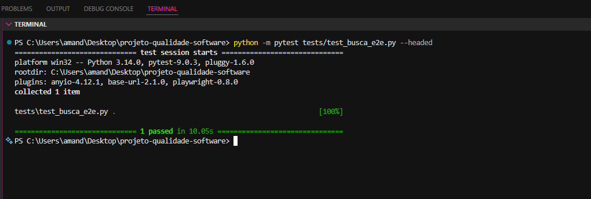

 # PBL 7 - Testes Funcionais Automatizados
 **Equipe:** asgurias (Amanda Duarte, Eduarda Costa e Luísa Rabassa)
 **Sistema Alvo:** LocalEats
 **Ferramentas:** Python 3 + Pytest + Playwright
 
 ## 1. Contexto e Objetivo
 O objetivo desta etapa é automatizar os testes funcionais do sistema completo (E2E) simulando o comportamento de um usuário real na interface gráfica. A finalidade é mitigar o retrabalho manual exaustivo identificado na Aula 06 e garantir que a integração entre o frontend e a API de restaurantes não seja quebrada por novos deploys.
 
 ## 2. Fluxo Escolhido e Desafios
 **Busca de Restaurantes com Autenticação:** Automatizamos a entrada na página inicial, inserção de termos na barra de busca e o acionamento do botão principal. Durante o desenvolvimento, o sistema exigiu autenticação (redirecionamento de sessão), o que nos forçou a mapear também o fluxo de entrada segura do usuário.
 
 ## 3. Código Gerado vs Código Refatorado
 
 ### A. Versão Bruta (Playwright Codegen)
 O comando `playwright codegen` gerou um script puramente imperativo e frágil.
 
 ```python
 # Script gerado inicialmente (Não escalável)
 from playwright.sync_api import sync_playwright
 
 def run(playwright):
     browser = playwright.chromium.launch(headless=False)
     page = browser.new_page()
     page.goto("[https: local-eats-unisenac.vercel.app/](https: local-eats-unisenac.vercel.app/)")
     page.get_by_placeholder("Pizza").fill("Italiana")
     page.get_by_role("button", name="Buscar").click()
     browser.close()
 ```
 
 ### B. Versão Refatorada (Page Object Model - POM)
 Para garantir a robustez do teste e aderir às boas práticas de engenharia, abstraímos a interface usando o padrão POM. Criamos as classes `HomePage` e `LoginPage`. Isso isolou os seletores da lógica de asserção, contornando erros de "Strict Mode" (múltiplos botões na tela) e lidando automaticamente com o redirecionamento de login.
 *(Os scripts completos estão na pasta `tests/` e `tests/pages/` do repositório).*
 
 ## 4. Evidência de Execução
 Abaixo está o registro da execução do script Pytest automatizando o navegador Chromium, autenticando no sistema e validando a busca com sucesso.
 
 
 
 ## 5. Reflexão no Contexto do LocalEats (Análise Crítica)
 
 **O teste quebrou em algum momento? Por quê?**
 Sim, diversas vezes. Primeiro, quebrou por timeout ao tentar achar o placeholder "Pizza", que havia mudado. Depois, o "Strict Mode" do Playwright travou o teste pois encontrou múltiplos campos de texto e botões na tela de login. Resolvemos isso mapeando os seletores exatos (`#loginForm`) através do POM.
 
 **O Codegen ajudou ou gerou problemas?**
 Ajudou na etapa inicial de exploração, permitindo mapear os seletores mais rapidamente. No entanto, o código gerado por ele é insustentável. Ele não lida com redirecionamentos inesperados (como expiração de sessão) e trava com qualquer mudança visual leve na interface.
 
 **Testes automatizados substituem testes manuais?**
 Não. Eles substituem os testes manuais repetitivos de regressão. Testes exploratórios focados em UX, heurísticas de usabilidade ou peculiaridades visuais complexas (como os problemas de sobreposição de CSS mobile relatados no nosso diagnóstico da Aula 06) ainda demandam a análise visual humana.
 
 **Qual tipo de teste deve ser priorizado?**
 Seguindo a pirâmide de testes estruturada na nossa consultoria inicial, os unitários (PBL 6) devem compor a vasta base por serem rápidos e baratos. Os testes funcionais/E2E em Playwright (PBL 7) devem ser priorizados estritamente para os fluxos vitais de faturamento do negócio (Login, Busca e Checkout) devido ao seu alto custo de manutenção.
 
 **Como isso ajuda no projeto do grupo?**
 Materializa a solução do nosso diagnóstico. Antes, tínhamos apenas prints atestando falhas da busca. Agora, a LocalEats possui uma malha de automação real. Qualquer desenvolvedor que quebrar o layout da barra de pesquisa ou o formulário de entrada no futuro não conseguirá enviar o código defeituoso para produção.