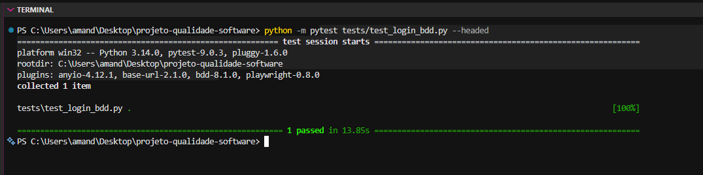

  # PBL 8 - BDD e Automação Orientada a Comportamento
  
  > **Equipe:** asgurias (Amanda Duarte, Eduarda Costa e Luísa Rabassa)
  > **Sistema Alvo:** LocalEats
  > **Ferramentas:** Python 3 + Pytest-BDD + Playwright
  
  ## 1. Contexto e Objetivo
  O objetivo final da nossa implantação de QA no LocalEats é estabelecer o BDD (Behavior-Driven Development). Com isso, criamos uma "documentação viva" onde as regras de negócio escritas em linguagem natural (Gherkin) se tornam diretamente os próprios testes automatizados, alinhando a visão de Produto, Desenvolvimento e Qualidade em um único artefato.
  
  ## 2. Cenário Desenvolvido (Gherkin)
  Escolhemos o fluxo de Autenticação (Login), pois é a principal barreira de segurança e acesso às funcionalidades (como visto no bloqueio durante o PBL 7).
  
  **Arquivo:** `tests/features/login.feature`
  
  ```gherkin
  Feature: Autenticação de Usuário
    Como um cliente do LocalEats
    Desejo fazer login no sistema
    Para acessar minha conta e realizar buscas
  
    Scenario: Login com credenciais válidas
      Given que eu acesso o sistema LocalEats
      When sou redirecionado para a tela de login
      And preencho o email "amanda@teste.com" e a senha "12345"
      And clico no botão Entrar
      Then devo ser autenticado com sucesso e ver a barra de busca
  ```
  
  ## 3. Implementação Técnica
  Para evitar acoplamento e fragilidade, os Step Definitions (`tests/test_login_bdd.py`) não manipulam a interface diretamente. Eles chamam as classes do Page Object Model (`LoginPage` e `HomePage`) construídas no PBL 7. Assim, o BDD gerencia o que deve acontecer, e o POM gerencia como interagir com o HTML.
  
  ## 4. Evidência de Execução
  Abaixo está o registro da execução, onde o pytest-bdd traduziu os passos da feature e orquestrou o Playwright com sucesso.
  
  
  
  ## 5. Reflexão no Contexto do LocalEats (Análise Crítica)
  
  **Quais dificuldades surgiram?**
  A maior dificuldade é definir a granularidade correta do Gherkin. O instinto inicial é escrever passos técnicos como "Clico no botão com ID #login", mas isso quebra o propósito do BDD. Foi necessário refatorar a escrita para focar no comportamento ("clico no botão Entrar").
  
  **Os seletores foram frágeis?**
  Graças à adoção prévia do Page Object Model no PBL 7, a fragilidade foi mitigada. Se os seletores do LocalEats mudarem amanhã, o arquivo `.feature` e o arquivo do BDD continuarão intactos, sendo necessário atualizar apenas a classe de mapeamento (`login_page.py`).
  
  **O cenário representa realmente uma regra de negócio?**
  Sim. A autenticação válida redirecionando para a home (onde a barra de busca está disponível) é a regra primária de acesso e retenção de usuários da plataforma.
  
  **BDD melhora comunicação entre equipe? Todo teste deve ser escrito em BDD?**
  Sim, melhora drasticamente por usar uma linguagem onipresente. Contudo, não deve ser usado para tudo. O BDD gera um overhead (esforço extra) de manutenção de arquivos e mapeamento. Ele deve ser reservado exclusivamente para fluxos críticos de negócio (E2E) onde Produto e Negócios precisam validar o comportamento. Testes de borda e lógicas obscuras devem continuar em testes unitários simples.
  
  **Como isso ajuda no projeto do grupo?**
  Coroa nosso diagnóstico de QA. Começamos com "caos técnico" e bugs em produção, passamos para um mapeamento de atributos (ISO 25000), descemos ao nível do código com TDD (Pytest) e agora entregamos à LocalEats uma Especificação Executável. A empresa agora possui um ecossistema de confiança, testável desde o micro (funções) até o macro (visão do usuário).