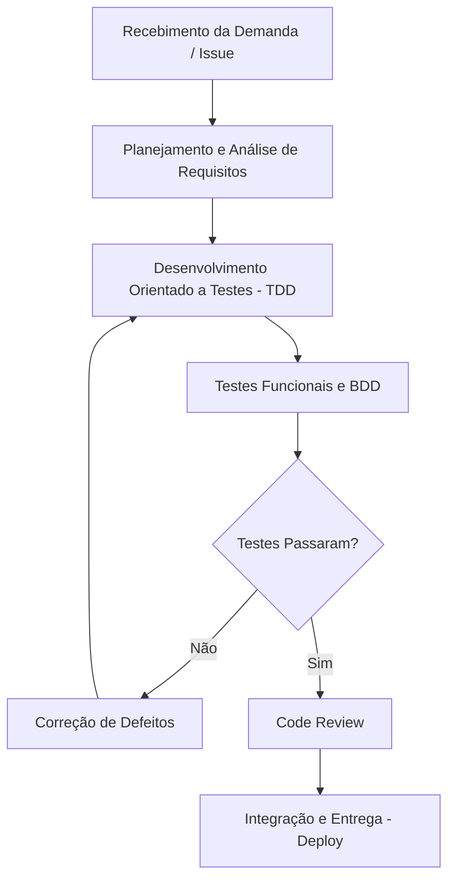

# PBL 9 - Qualidade de Processo

> **Equipe:** Amanda Duarte, Eduarda Costa e Luísa Rabassa
> **Sistema Alvo:** LocalEats

## 1. Mapeamento do Processo Atual
Abaixo apresentamos o fluxo de trabalho da nossa equipe, desde o recebimento da demanda até a entrega, utilizando a representação Mermaid:

## 2. Tabela de Entradas, Atividades e Saídas

| Etapa | Entrada | Atividade | Saída |
| --- | --- | --- | --- |
| **1. Planejamento** | Necessidade do Negócio / Bug | Refinamento e criação de Critérios de Aceitação | Tarefa (Issue) detalhada |
| **2. Desenvolvimento (TDD)** | Tarefa detalhada | Escrita de testes unitários seguidos de código funcional | Código implementado e testes passando |
| **3. Testes Funcionais/BDD** | Código implementado | Criação e execução de testes E2E (Playwright) | Relatório de testes automatizados |
| **4. Correções** | Relatório de falhas | Análise e refatoração do código com base nos erros | Código corrigido |
| **5. Entrega** | Código testado e validado | Revisão final e deploy na Vercel | Funcionalidade em Produção |

## 3. Reflexão sobre o Processo

* **O processo utilizado pela equipe está claramente definido?** Sim, evoluímos de um cenário de "caos técnico" para um fluxo onde o desenvolvimento é guiado por testes.
* **Todos os integrantes seguem o mesmo fluxo de trabalho?** Sim, as atividades estão padronizadas com a utilização do GitHub para gestão do código.
* **Em quais etapas a qualidade é verificada?** A qualidade é verificada de forma contínua: inicialmente no TDD (unitário), depois na automação funcional (Playwright/BDD) e, por fim, numa revisão de código antes do deploy.
* **Quais melhorias poderiam tornar o processo mais eficiente?** A implementação de um pipeline de Integração Contínua (CI) no GitHub Actions, para rodar os testes de forma automática a cada "push".
* **Como a qualidade do processo impacta a qualidade do produto final?** Um processo bem definido elimina o retrabalho e garante que falhas (como a quebra de layout mobile ou erros na busca) sejam interceptadas antes de chegarem aos usuários reais.
